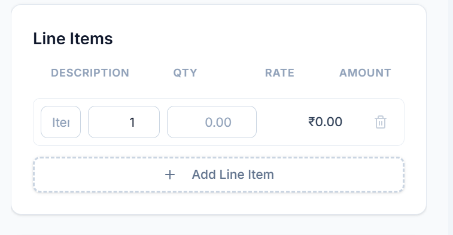

in discount tab needs to add precentage and amount clint can be select wht needs to change 
line items alignment need to change 
In settings option needs to have footer for invoice option add in settings  
if user send feedback how can i check
invoice no needs to be first four letter business name and balance 6 letter needs to be date and random no
 not visible clearly 

Version 2
Business owner can preset the item name unit type and price and invoice creating time can add by using dropdown and other fields fill by defalut can edit

create admin profile on website so i can check the feedback user engagement and usage details
Make this website secured from hacker and spamer
Add new page call Dashboard here can see 